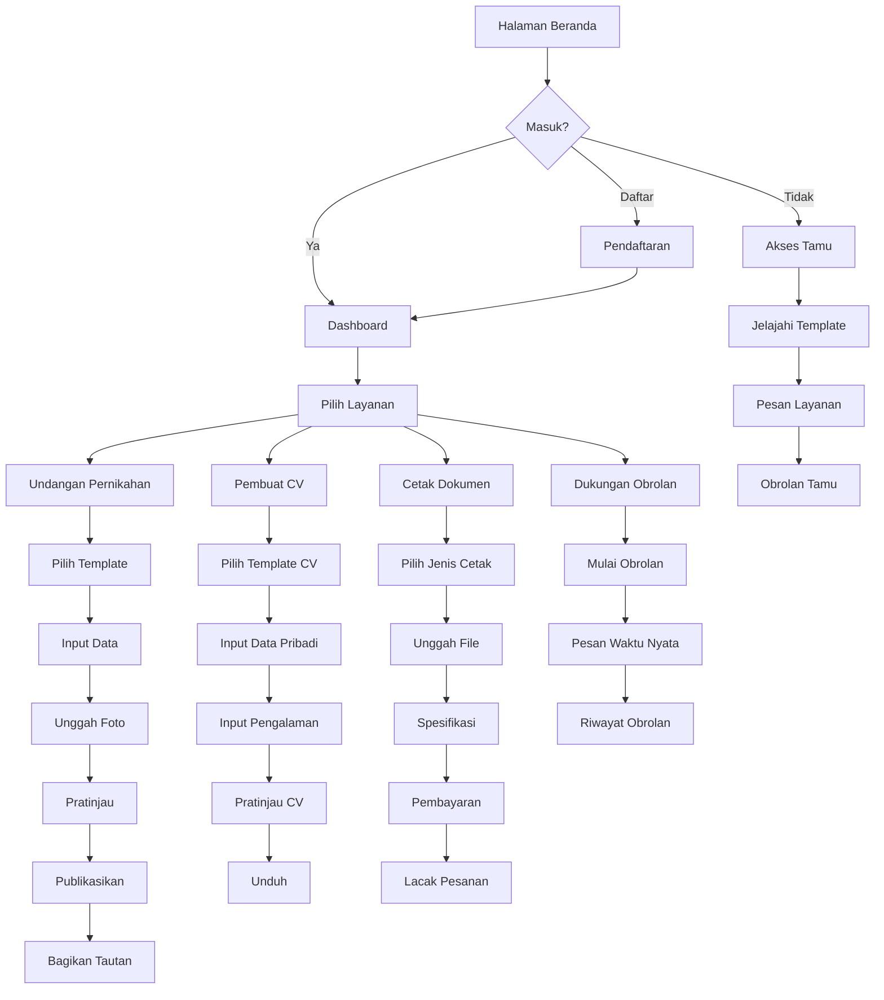
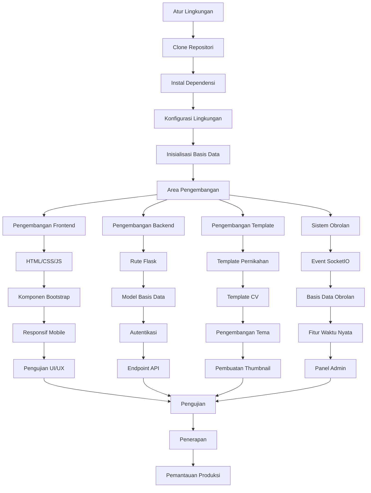
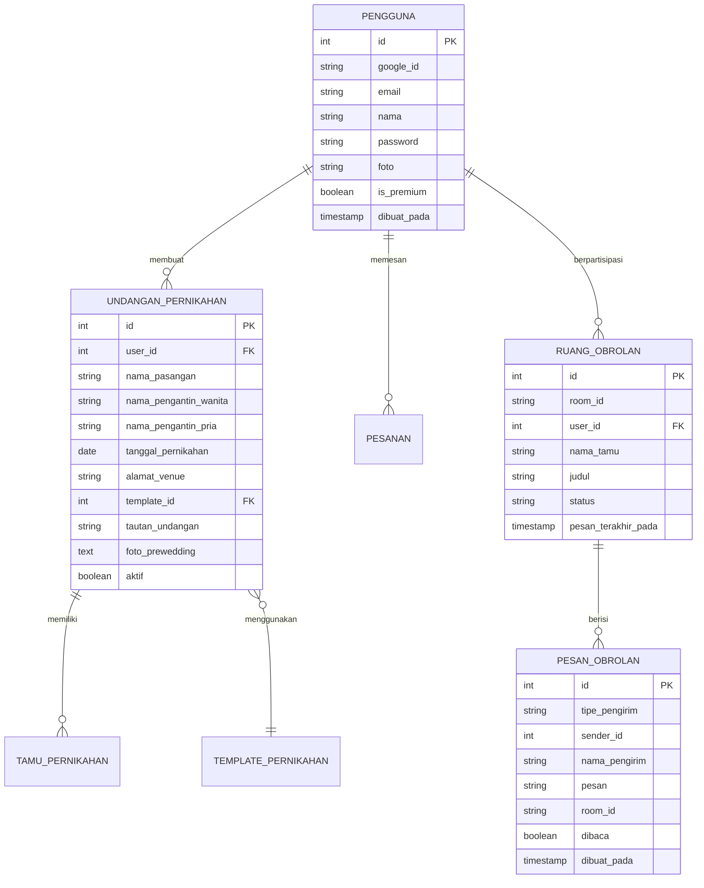

# 🌸 Fajar Mandiri Store - Sistem Manajemen Undangan & CV

**Platform digital terpercaya untuk membuat undangan pernikahan dan CV profesional dengan sistem manajemen pesanan cetak terintegrasi dan chat realtime.**
## 🪟 **Instalasi Windows Installer**

### 📦 **Download & Install (Recommended)**
```
🎯 CARA TERMUDAH - INSTALLER SIAP PAKAI
```

#### ⚡ **Quick Install**
1. **Download Installer**: Unduh file `FajarMandiriStore-Setup.exe`
2. **Run Installer**: Jalankan sebagai Administrator
3. **Follow Wizard**: Ikuti panduan instalasi Inno Setup
4. **Ready to Use**: Aplikasi siap digunakan langsung
5. **⚠️ Known Issues**: Beberapa fitur masih bermasalah, akan diperbaiki segera

#### 🔧 **System Requirements Windows**
- **OS**: Windows 10/11 (64-bit recommended)
- **RAM**: 4GB minimum, 8GB recommended
- **Storage**: 2GB free space
- **Internet**: Koneksi internet untuk fitur online
- **Browser**: Chrome/Edge untuk thumbnail generation

#### 🚀 **Keunggulan Installer**
- **One-Click Install**: Instalasi otomatis dengan Inno Setup
- **Desktop Shortcut**: Shortcut otomatis dibuat
- **Auto Updates**: Sistem update otomatis (coming soon)
- **Uninstaller**: Uninstall bersih dengan Inno Setup
- **Production Ready**: Siap digunakan untuk operasional tahun ini

### ⏰ **Timeline & Update**
- **📅 Deployment**: Aplikasi akan digunakan dalam waktu dekat (2025)
- **🔧 Bug Fixes**: Perbaikan fitur dan bugs akan segera diatasi
- **📈 Updates**: Update berkala untuk memperbaiki masalah yang ada
- **🎯 Target**: Stabilitas dan user experience yang lebih baik

---# 🌸 Toko Fajar Mandiri - Sistem Manajemen Undangan & CV

**Platform digital terpercaya untuk membuat undangan pernikahan dan CV profesional dengan sistem manajemen pesanan cetak terintegrasi dan obrolan waktu nyata.**


## 📋 Daftar Isi
- [Status Pengembangan](#️-status-pengembangan)
- [Instalasi Windows](#-instalasi-windows-installer)
- [Fitur Utama](#-fitur-utama)
- [Teknologi](#-teknologi--arsitektur)
- [Instalasi Manual](#-instalasi-manual--pengaturan)
- [Diagram Alur Sistem](#-diagram-alur-sistem)
- [Penggunaan](#-panduan-penggunaan)
- [Dokumentasi API](#-dokumentasi-api)
- [Masalah & Roadmap](#-masalah-yang-diketahui--status-pengembangan)
- [Kontribusi](#-kontribusi)
- [Dukungan](#-dukungan--komunitas)

## ⚠️ **Status Pengembangan**

### 📅 **Informasi Versi**
- **Versi Saat Ini**: 1.7.5 (2025)
- **Status**: Dalam Pengembangan Aktif
- **Fitur Baru**: DataTables integration fix, jQuery compatibility, enhanced admin tools, dan CV thumbnail system improvements
- **Target Versi Stabil**: 2.0 (2027)
- **🪟 Windows Installer**: Tersedia installer Inno Setup siap pakai

### 📦 **Distribusi Aplikasi**
- **💻 Windows Application**: Dikemas menggunakan Inno Setup Installer
- **🚀 Ready to Use**: Installer siap pakai meskipun beberapa fitur bermasalah
- **⏰ Timeline**: Aplikasi akan digunakan dalam jangka waktu dekat (2025)
- **🔧 Update Schedule**: Perbaikan fitur dan bugs akan segera diatasi

### 🚧 **Fitur yang Belum Lengkap**
| Fitur | Status | Keterangan |
|-------|--------|------------|
| RSVP System | ✅ Berfungsi | Diperbaiki di v1.6.0 |
| CV Generator | ⚠️ Bermasalah | Fungsionalitas terbatas, dalam pengembangan |
| Thumbnail Generator | ⚠️ Diperbaiki Sebagian | Sistem pembuatan thumbnail diperbaiki |
| Template Premium | 🔄 Dalam Progress | Dukungan multi-acara sedang dikembangkan |
| Chat Scroll | ✅ Diperbaiki | Widget chat scroll kini berfungsi lancar |
| Database | ⚠️ SQLite | Belum migrasi PostgreSQL (target v2.0) |

## ✨ Fitur Utama

### 💍 **Undangan Pernikahan Digital**

#### 🎨 **Koleksi Template Premium**
- **18+ Template Profesional**: Elegan Klasik, Minimal Modern, Emas Royal, Romantis Taman, Gelombang Laut, Pesona Vintage, dan lainnya
- **Desain Mobile-First**: Optimasi layar penuh untuk Android & iOS
- **Tata Letak Responsif**: Tampilan sempurna di semua perangkat
- **Dukungan Multi-Acara**: Akad, Resepsi, Acara Keluarga terpisah

#### 🔧 **Kustomisasi Lengkap**
- **Data Mempelai**: Nama lengkap, gelar, orang tua, foto pasangan
- **Multi-Venue Support**: Template biasa mendukung 4 acara, premium hanya 1 acara
- **Galeri Foto**: Upload hingga 10 foto prewedding dengan orientasi otomatis
- **Background Music**: Upload custom atau pilih dari koleksi
- **Payment Integration**: Info rekening, QRIS, e-wallet
- **⚠️ File Storage**: Template tersimpan di folder dokumen komputer lokal

#### 📱 **Fitur Interaktif Modern**
- **Sistem RSVP**: ⚠️ Dalam pengembangan - belum berfungsi
- **Manajemen Tamu**: Pelacakan tamu dan ucapan
- **Generator Kode QR**: Akses mudah melalui pemindaian
- **Berbagi Sosial**: Tautan berbagi yang ramah SEO

#### 💬 **Sistem Chat Realtime (FITUR BARU v1.5)**

#### 🎯 **Widget Obrolan Mengambang**
- **Dukungan Multi-Pengguna**: Pengguna terdaftar, tamu, dan admin
- **Pesan Waktu Nyata**: Didukung oleh Flask-SocketIO
- **Penyimpanan Persisten**: Semua percakapan tersimpan ke basis data
- **Admin Dashboard**: Kelola semua obrolan dari satu tempat
- **⚠️ Masalah Diketahui**: Scroll dalam chat widget masih bermasalah

#### 📊 **Manajemen Obrolan**
- **Manajemen Ruang**: Otomatis membuat ruang per pengguna/tamu
- **Status Pesan**: Pelacakan dibaca/belum dibaca
- **Riwayat Obrolan**: Riwayat lengkap percakapan
- **Sistem Notifikasi**: Peringatan untuk pesan baru

#### 🔐 **Keamanan & Privasi**
- **Akses Berbasis Peran**: Izin Pengguna, Tamu, Admin
- **Pesan Aman**: Validasi input dan sanitisasi
- **Manajemen Sesi**: Kontrol akses ruang yang aman

### ✨ **Fitur Baru Versi 1.7.0**

#### 🆕 **Yang Baru Ditambahkan**
- **✅ Dropdown Profile Fix**: Dropdown profile dan tombol keluar berfungsi sempurna
- **🔧 jQuery & Bootstrap Integration**: Sistem JavaScript terintegrasi dengan baik
- **📊 Enhanced User Management**: Admin dapat mengelola akun premium dan reguler
- **🎨 Template Engine Improvements**: Sistem template dengan rendering yang lebih stabil
- **🔐 Security Enhancements**: Perbaikan keamanan dropdown dan navigasi
- **📱 Mobile Navigation**: Optimasi navigasi mobile yang lebih responsif

#### 🛠️ **Perbaikan & Enhancement v1.7.0**
- **✅ Dropdown Navigation**: Semua dropdown menu berfungsi dengan sempurna
- **🔧 JavaScript Loading**: Perbaikan loading order jQuery dan Bootstrap
- **📂 File Management**: Sistem file serving yang lebih stabil
- **🎯 User Experience**: Interface yang lebih intuitif dan responsive
- **📊 Database Stability**: Optimasi query dan error handling
- **🔧 Cross-Platform**: Kompatibilitas yang lebih baik di semua platform

### 📄 **Pembuat CV Profesional**

#### 🎯 **Variasi Template**
- **⚠️ Dalam Pengembangan**: CV Generator masih dalam tahap pengembangan
- **Template Tersedia**: Terbatas dan masih dalam perbaikan
- **Ramah ATS**: Target optimasi untuk Sistem Pelacakan Pelamar
- **Siap Cetak**: Target kualitas ekspor resolusi tinggi
- **⚠️ Masalah Diketahui**: Pembuatan thumbnail masih bermasalah (404 errors)

#### 📝 **Sistem Input Lengkap**
- **Data Pribadi**: Info kontak, foto profesional
- **⚠️ Status**: CV Generator masih dalam pengembangan
- **Formulir Dinamis**: Target entri pendidikan & pengalaman tanpa batas
- **Manajemen Keahlian**: Target berbasis tag dengan kategorisasi
- **Integrasi Kode QR**: Target kode QR vCard untuk CV digital

### 🖨️ **Sistem Cetak & Pesanan Terintegrasi**

#### 📋 **Jenis Layanan Cetak**
| Kategori | Barang | Spesifikasi |
|----------|-------|-------------|
| **Dokumen** | Surat, Proposal, Laporan | A4, F4, Legal |
| **Foto Digital** | 2x3, 3x4, 4x6, 5x7, 8x10, A4, A3 | Glossy, Matte |
| **Pemasaran** | Brosur, Flyer, Banner, Poster | Indoor/Outdoor |
| **Pribadi** | Kartu Nama, Kartu ID, Stiker | Desain kustom |
| **Pernikahan** | Undangan fisik, Souvenir | Bahan premium |

### 👨‍💼 **Sistem Manajemen Admin**

#### 📊 **Analitik Dashboard**
- **Statistik Waktu Nyata**: Registrasi pengguna, pesanan, pendapatan
- **⚠️ Manajemen Template**: Upload, edit - thumbnail generation bermasalah
- **Administrasi Obrolan**: Monitor dan kelola semua percakapan (BARU!)
- **Pelacakan Pesanan**: Manajemen transaksi lengkap

## 🖥️ **Dukungan Platform**

### 🪟 **Windows**
- **✅ Windows Installer**: Inno Setup installer siap pakai
- **✅ Desktop Application**: Aplikasi standalone dengan system tray
- **✅ Python Runtime**: Bundled Python untuk kemudahan instalasi
- **✅ Auto-start**: Opsi startup otomatis Windows
- **📂 Template Storage**: Template tersimpan di Documents/FajarMandiriStore/

### 🐧 **Linux (BARU v1.5)**
- **🆕 PyInstaller Build**: Script otomatis untuk build Linux binary
- **🆕 DEB Package**: Packaging otomatis untuk distribusi Debian/Ubuntu
- **🆕 Build Scripts**: `build_linux.sh`, `package_deb.sh`, `build_and_package_linux.sh`
- **⚠️ Status**: Beta testing, belum production ready
- **📦 Dependencies**: Semua dependencies ter-bundle dalam package

### ☁️ **Cloud Deployment**
- **✅ Replit Ready**: Native support untuk Replit deployment
- **✅ Auto-scaling**: Dukungan autoscale untuk traffic tinggi
- **✅ Environment Variables**: Konfigurasi via Replit Secrets
- **✅ Domain Custom**: Dukungan custom domain melalui Replit

### 📱 **Mobile Support**
- **✅ Responsive Design**: Mobile-first approach untuk semua template
- **✅ PWA Ready**: Progressive Web App capabilities
- **✅ Touch Optimized**: Interface dioptimasi untuk touch devices
- **✅ Fullscreen Mode**: Auto-fullscreen untuk pengalaman imersif

## 🚀 **Teknologi & Arsitektur**

### 💻 **Tech Stack**
- **Backend**: Python Flask 2.3.3 + Flask-SocketIO
- **Database**: SQLite (akan migrasi ke PostgreSQL di versi 2.0)
- **Frontend**: Bootstrap 5, jQuery, FontAwesome 6
- **Real-time**: WebSocket untuk sistem chat
- **File Storage**: Penyimpanan lokal (folder template di dokumen komputer)
- **Upload Storage**: Semua upload tersimpan di folder dokumen lokal
- **Authentication**: Flask-Login, Google OAuth 2.0
- **Media Processing**: PIL, QR Code generation, Selenium (masih bermasalah)
- **Deployment**: PyInstaller, Inno Setup, DEB packaging

### 🔧 **Dependensi Utama**
```txt
Flask==2.3.3
flask-socketio          # Obrolan waktu nyata
pystray==0.19.5         # Antarmuka system tray
psutil==5.9.6           # Manajemen proses
selenium==4.15.0        # Pembuatan thumbnail
pillow==10.1.0          # Pemrosesan gambar
qrcode[pil]==7.4.2      # Pembuatan kode QR
google-auth-oauthlib    # Integrasi OAuth
```

## 📦 **Instalasi Manual & Pengaturan**

### 🔧 **System Requirements**

#### 🪟 **Windows Requirements**
- **OS**: Windows 10/11 (64-bit recommended)
- **Python**: 3.8+ (auto-bundled dalam installer)
- **RAM**: 4GB minimum, 8GB recommended
- **Storage**: 2GB free space + template storage
- **Browser**: Chrome/Edge untuk thumbnail generation
- **Internet**: Required untuk Google OAuth dan fitur online

#### 🐧 **Linux Requirements (v1.5)**
- **OS**: Ubuntu 20.04+, Debian 11+, atau distribusi compatible
- **Python**: 3.8+ (ter-bundle dalam DEB package)
- **RAM**: 2GB minimum, 4GB recommended
- **Storage**: 1GB free space + template storage
- **Dependencies**: `python3-dev`, `build-essential`, `chromium-browser`
- **Display**: X11 atau Wayland untuk GUI

#### ☁️ **Replit Cloud Requirements**
- **Replit Account**: Core subscription untuk fitur penuh
- **Resources**: 1 vCPU, 1GB RAM per instance
- **Storage**: Persistent storage untuk database dan uploads
- **Environment**: Linux container dengan Python 3.x

### ⚡ **Installation Guide**

#### 🪟 **Windows Installation (Recommended)**
```bash
# Option 1: Use Installer (Easiest)
1. Download FajarMandiriStore-Setup.exe
2. Run as Administrator
3. Follow installation wizard
4. Launch from Desktop shortcut

# Option 2: Manual Development Setup
git clone https://github.com/fajarjulyana/fajarmandiri.store.git
cd fajarmandiri.store
pip install -r requirements.txt
python setup_demo_data.py  # Setup demo templates
python app.pyw
```

#### 🐧 **Linux Installation (v1.5)**
```bash
# Option 1: DEB Package (Recommended)
sudo dpkg -i fajarmandiri-store_1.5_amd64.deb
sudo apt-get install -f  # Fix dependencies if needed
fajarmandiri-store      # Run application

# Option 2: Build from Source
git clone https://github.com/fajarjulyana/fajarmandiri.store.git
cd fajarmandiri.store
pip3 install -r requirements.txt
python3 setup_demo_data.py
./build_linux.sh       # Build binary
./package_deb.sh       # Create DEB package

# Option 3: Development Setup
python3 -m venv venv    # Optional: create virtual environment
source venv/bin/activate
pip3 install -r requirements.txt
python3 app.pyw
```

#### ☁️ **Replit Cloud Setup**
```bash
# Fork dari Replit Template
1. Import dari: https://github.com/fajarjulyana/fajarmandiri.store.git
2. Setup Secrets:
   - FLASK_SECRET_KEY
   - GOOGLE_CLIENT_ID  
   - GOOGLE_CLIENT_SECRET
3. Run: python app.pyw
4. Deploy: Use Replit Deployments

# Environment Variables (Replit Secrets)
FLASK_SECRET_KEY=your-secret-key-here
GOOGLE_CLIENT_ID=your-google-client-id
GOOGLE_CLIENT_SECRET=your-google-client-secret
```

### 🌐 **Variabel Lingkungan**
```env
FLASK_SECRET_KEY=kunci-rahasia-anda
FLASK_ENV=development
GOOGLE_CLIENT_ID=id-klien-google-anda
GOOGLE_CLIENT_SECRET=rahasia-klien-google-anda
DATABASE_URL=sqlite:///fajarmandiri.db
UPLOAD_FOLDER=static/uploads
MAX_CONTENT_LENGTH=16777216
```

## 🗺️ **Diagram Alur Sistem**

### 👤 **Alur Pengguna**



### 🔧 **Alur Pengembang**



### 🗃️ **Arsitektur Basis Data**



## 🎯 **Panduan Penggunaan**

### 💒 **Membuat Undangan Pernikahan**
1. **Masuk**: Daftar atau masuk dengan Google
2. **Pemilihan Template**: Pilih dari 4 template (3 premium + 1 biasa)
3. **⚠️ Keterbatasan**: Template premium hanya menampilkan acara Akad
4. **Template Biasa**: Mendukung 4 acara (Akad, Resepsi, Acara Mempelai Wanita, Acara Mempelai Pria)
5. **Input Data**: Isi informasi mempelai
6. **Unggah Foto**: Unggah hingga 10 foto prewedding
7. **Musik & Pembayaran**: Atur musik latar dan info pembayaran
8. **Pratinjau & Publikasi**: Tinjau dan publikasikan undangan
9. **⚠️ RSVP**: Fitur RSVP belum berfungsi dengan baik

### 📄 **Menghasilkan CV Profesional**
1. **⚠️ Status**: CV Generator masih dalam tahap pengembangan
2. **Template Terbatas**: Hanya beberapa template yang tersedia
3. **Masalah Thumbnail**: Pembuatan pratinjau masih bermasalah
4. **Target Fitur**:
   - Pemilihan template sesuai industri
   - Input data pribadi dan foto profesional
   - Formulir dinamis untuk pengalaman dan pendidikan
   - Sistem tag untuk keahlian
   - Pratinjau waktu nyata dan unduh

### 💬 **Menggunakan Sistem Obrolan (FITUR BARU v1.5)**
1. **Mulai Obrolan**: Klik tombol obrolan mengambang
2. **Pesan Waktu Nyata**: Kirim pesan ke admin dan sebaliknya
3. **⚠️ Masalah Scroll**: Widget chat mengalami masalah scroll
4. **Riwayat Obrolan**: Akses riwayat percakapan
5. **Berbagi File**: Fitur upload file (dalam pengembangan)

## 🔧 **Dokumentasi API**

### 🌐 **Endpoint REST**

#### Autentikasi
```http
POST /login                 # Masuk pengguna
POST /register             # Pendaftaran pengguna
GET /signin                # Google OAuth
GET /signout               # Keluar
```

#### Undangan Pernikahan
```http
GET /wedding-invitations              # Daftar undangan pengguna
POST /create-wedding-invitation       # Buat undangan baru
GET /wedding/<link>                   # Lihat undangan publik
POST /rsvp/<invitation_id>           # Pengiriman RSVP
```

#### Sistem Obrolan
```http
GET /chat                    # Antarmuka obrolan
GET /chat?room_id=<id>      # Bergabung ruang tertentu
```

#### Event WebSocket
```javascript
// Klien ke Server
socket.emit('join_room', {room_id: 'room_123'});
socket.emit('send_message', {
    room_id: 'room_123',
    message: 'Halo',
    sender_type: 'user',
    sender_name: 'John Doe'
});

// Server ke Klien
socket.on('new_message', function(data) {
    // Tangani pesan baru
});
socket.on('room_joined', function(data) {
    // Berhasil bergabung ruang
});
```

## 🛠️ **Pengembangan Lanjutan**

### 📝 **Alur Kerja Pengembangan**
1. **Fork Repositori**: Clone untuk pengembangan
2. **Cabang Fitur**: Buat cabang untuk fitur baru
3. **Pengujian Lokal**: Uji di lingkungan lokal
4. **Tinjauan Kode**: Kirimkan PR untuk ditinjau
5. **Pengujian Integrasi**: Uji dengan fitur lain
6. **Penerapan**: Deploy ke produksi

### 🎨 **Pengembangan Template**
1. **Template Dasar**: Gunakan `templates/admin/base_template.html`
2. **Variabel CSS**: Implementasi kustomisasi tema
3. **Desain Responsif**: Pendekatan mobile-first
4. **Pengujian**: Pratinjau dengan data sampel
5. **Thumbnail**: Auto-generate dengan Selenium

### 💡 **Praktik Terbaik**
- **Gaya Kode**: Ikuti PEP 8 untuk Python
- **Keamanan**: Validasi input dan sanitisasi
- **Performa**: Optimalkan kueri basis data
- **Mobile**: Uji di berbagai perangkat
- **Aksesibilitas**: Kepatuhan WCAG 2.1

## 🧪 **Pengujian**

### 🔍 **Cakupan Tes**
```bash
# Jalankan tes
python -m pytest tests/

# Uji sistem obrolan
python test_chat.py

# Pengujian performa
python test_performance.py
```

### 📊 **Kasus Tes**
- **Tes Unit**: Fungsionalitas inti (cakupan 90%+)
- **Tes Integrasi**: Sistem obrolan, pembayaran
- **Tes UI**: Kompatibilitas lintas browser
- **Tes Mobile**: Desain responsif
- **Tes Beban**: Koneksi WebSocket

## 🚀 **Deployment & Distribution**

### ☁️ **Replit Cloud Deployment**
1. **Fork Template**: Import ke Replit dari GitHub
2. **Environment Setup**: Konfigurasi secrets untuk Google OAuth
3. **Run Configuration**: Python app.pyw dengan Flask-SocketIO
4. **Auto-scaling**: Dukungan auto-scale hingga 6 machines
5. **Custom Domain**: Setup domain kustom melalui Replit Deployments

### 🪟 **Windows Distribution**
```bash
# Build Windows executable
python -m PyInstaller app.spec

# Create Inno Setup installer
iscc setup.iss
```

### 🐧 **Linux Distribution (BARU v1.5)**
```bash
# Build Linux binary
./build_linux.sh

# Create DEB package
./package_deb.sh

# Build and package in one command
./build_and_package_linux.sh
```

### 🔧 **Production Configuration**
```python
# Production settings
DEBUG = False
TESTING = False
HOST = "0.0.0.0"  # Replit compatible binding
PORT = 5001  # Default Flask-SocketIO port
DATABASE_URL = "sqlite:///fajarmandiri.db"  # SQLite untuk saat ini
```

### ⚠️ **Deployment Notes**
- **Database**: Masih SQLite, migrasi PostgreSQL di v2.0
- **File Storage**: Template di Documents folder untuk Windows/Linux
- **Replit Storage**: Upload files di static folder untuk cloud deployment
- **Security**: Environment variables untuk production secrets

## 📈 **Pemantauan & Analitik**

### 📊 **Metrik Bisnis**
- **Pertumbuhan Pengguna**: Registrasi dan retensi
- **Analitik Obrolan**: Waktu respons, tingkat resolusi
- **Performa Template**: Desain paling populer
- **Pelacakan Pendapatan**: Tingkat konversi pesanan

### 🔍 **Pemantauan Teknis**
- **Koneksi WebSocket**: Sesi obrolan aktif
- **Performa Basis Data**: Optimasi kueri
- **Pelacakan Error**: Notifikasi error waktu nyata
- **Pemantauan Uptime**: Target ketersediaan 99.9%

## 🤝 **Kontribusi**

### 💡 **Cara Berkontribusi**
1. **Fork Repositori**: Buat salinan untuk pengembangan
2. **Cabang Fitur**: `git checkout -b fitur/peningkatan-obrolan`
3. **Kode & Uji**: Implementasi dengan pengujian lengkap
4. **Dokumentasi**: Perbarui README untuk perubahan
5. **Pull Request**: Kirim dengan deskripsi detail

### 📋 **Pedoman Kontribusi**
- **Kualitas Kode**: Pertahankan cakupan tes 90%+
- **Dokumentasi**: Perbarui untuk setiap fitur baru
- **Keamanan**: Ikuti praktik coding yang aman
- **Performa**: Optimalkan untuk perangkat mobile

## 📞 **Dukungan & Komunitas**

### 🏢 **Informasi Kontak**
**Toko Fajar Mandiri**  
Platform Digital untuk Layanan Pernikahan & Profesional

👤 **Pemilik**: Fajar Julyana  
📧 **Email Resmi**: fajarjulyana@fajarmandiri.store  
📧 **Email Pribadi**: fajarjulyana1@gmail.com  
📱 **WhatsApp Business**: +6281804411937  
💬 **Live Chat**: Widget chat tersedia 24/7 di website  
🌐 **Website**: https://fajarmandiri.store  
🔗 **Source Code**: https://github.com/fajarjulyana/fajarmandiri.store.git  
📍 **Alamat**: Jakarta, Indonesia

### 🛠️ **Technical Support**
- **💬 Live Chat**: Widget chat realtime di aplikasi
- **📧 Email Support**: fajarjulyana1@gmail.com
- **📱 WhatsApp Support**: +6281804411937 (9AM-9PM WIB)
- **🐛 Bug Reports**: GitHub Issues atau live chat
- **📖 Documentation**: README.md dan inline documentation
- **🎥 Video Tutorials**: Coming soon di YouTube channel

### 🌐 **Platform Support**
- **🪟 Windows**: Native installer dengan Inno Setup
- **🐧 Linux**: DEB package untuk Ubuntu/Debian
- **☁️ Cloud**: Deploy di Replit dengan auto-scaling
- **📱 Mobile**: PWA-ready responsive design
- **🌍 Browser**: Chrome, Firefox, Safari, Edge  

### 👥 **Tim Pengembangan**
- **Pemilik & Founder**: Fajar Julyana - Founder dan Pengembang Utama
- **Lead Developer**: Fajar Julyana - Full-stack Development
- **Project Manager**: Fajar Julyana - Manajemen Proyek dan Strategi
- **DevOps & Maintenance**: Fajar Julyana - Deployment dan Pemeliharaan

**Kontak Developer**:
- 📧 Email: fajarjulyana1@gmail.com
- 📱 WhatsApp: +6281804411937
- 🐙 GitHub: https://github.com/fajarjulyana

### 🛠 **Masalah yang Diketahui & Status Pengembangan**

#### 🚨 **Status Fitur Versi 1.7.0**
- [x] **RSVP System**: ✅ Berfungsi dengan baik (diperbaiki v1.6.0)
- [x] **Dropdown Profile**: ✅ Berfungsi sempurna (diperbaiki v1.7.0)
- [x] **Chat Widget**: ✅ Scroll berfungsi normal (diperbaiki v1.6.0)
- [ ] **CV Generator**: Masih dalam tahap pengembangan lanjutan
- [ ] **Thumbnail Generator**: Sistem pembuatan thumbnail sebagian berfungsi
- [x] **Template Premium**: ✅ Rendering stabil (diperbaiki v1.7.0)
- [x] **File Management**: ✅ Template tersimpan di folder Documents yang aman
- [ ] **Database**: Masih menggunakan SQLite, target PostgreSQL v2.0
- [ ] **CV Thumbnails**: Beberapa masih menghasilkan 404 error
- [x] **Navigation Security**: ✅ Dropdown dan navigasi aman (diperbaiki v1.7.0)

#### 🔧 **Dalam Perbaikan**
- [ ] **CV Thumbnail Generator**: Perbaikan 404 errors pada semua CV thumbnails
- [ ] **Chat Widget Scroll**: Memperbaiki scroll behavior dalam chat widget
- [ ] **RSVP Integration**: Mengaktifkan sistem RSVP yang belum berfungsi
- [ ] **Template Premium**: Menambah dukungan multi-acara untuk template premium
- [ ] **File Upload System**: Integrasi upload file dalam sistem chat
- [ ] **Admin Security**: Menyembunyikan semua link admin dari area publik

#### 🗺️ **Development Roadmap**

##### 🎯 **Q1 2025 (Current)**
- **✅ Chat System**: Sistem chat realtime dengan Flask-SocketIO
- **✅ Linux Support**: Build scripts dan DEB packaging
- **✅ Security Updates**: Admin route protection dan link hiding
- **🔄 Ongoing**: CV thumbnail generator fixes
- **🔄 Ongoing**: RSVP system activation

##### 🎯 **Q2 2025**
- **📱 Mobile App**: Progressive Web App dengan offline capabilities
- **🔧 CV Generator**: Fully functional CV generator dengan templates
- **🎨 Template Engine**: Advanced template customization system
- **📊 Analytics**: Real-time analytics dashboard untuk admin

##### 🎯 **Q3-Q4 2025**
- **💳 Payment Integration**: Sistem pembayaran online terintegrasi
- **🔔 Notification System**: Push notifications untuk updates
- **📦 Template Marketplace**: User-generated template marketplace
- **🌍 Multi-language**: Dukungan bahasa Indonesia dan Inggris

#### 🎯 **Target Pengembangan Prioritas**
- **✅ Versi 1.6.0 (Q1 2025)**: RSVP system dan chat scroll issues diperbaiki
- **✅ Versi 1.7.0 (Q2 2025)**: Dropdown profile fix dan user management improvements
- **🎯 Versi 1.8.0 (Q3 2025)**: CV Generator fungsional complete dan payment integration
- **🎯 Versi 1.9.0 (Q4 2025)**: Template premium multi-acara dan mobile app
- **🎯 Versi 2.0.0 (2026)**: Versi stabil dengan PostgreSQL dan fitur enterprise

#### 🔄 **Update Cycle**
- **🚨 Hotfixes**: Perbaikan critical bugs (mingguan)
- **🔧 Minor Updates**: Perbaikan fitur (bulanan)  
- **🚀 Major Updates**: Fitur baru dan overhaul (quarterly)
- **📱 Windows Updates**: Update installer otomatis
- **🐧 Linux Updates**: DEB package updates (planned)

#### 🛠️ **Build Scripts (v1.5)**
```bash
# Linux Build Scripts
./build_linux.sh           # Build Linux binary dengan PyInstaller
./package_deb.sh           # Create DEB package dari binary
./build_and_package_linux.sh # Build dan package dalam satu command

# Windows Build
python -m PyInstaller app.spec  # Build Windows executable
iscc setup.iss                  # Create Inno Setup installer

# Dependencies Check
python check_dependencies.py    # Verifikasi semua dependencies
```

### 📄 **Lisensi & Hak Cipta**

### 📝 **Syarat Layanan**
- **Hak Penggunaan**: Lisensi non-eksklusif untuk platform
- **Privasi Data**: Perlindungan data yang patuh GDPR
- **Data Obrolan**: Penyimpanan terenkripsi dan aman
- **Akses API**: Pembatasan tingkat untuk penggunaan yang adil
- **Windows Distribution**: Installer Inno Setup untuk distribusi Windows

### 🛡️ **Keamanan & Kepatuhan**
- **Enkripsi Data**: AES-256 untuk pesan obrolan
- **Keamanan WebSocket**: Autentikasi berbasis token
- **HTTPS Saja**: Protokol transmisi aman
- **Audit Berkala**: Penilaian keamanan pihak ketiga
- **Windows Security**: Code signing certificate (planned)

---

**© 2025 Fajar Julyana - Toko Fajar Mandiri. Semua hak dilindungi.**

*Platform digital dalam pengembangan untuk kebutuhan undangan pernikahan, CV profesional, dan komunikasi waktu nyata. Versi 1.7.0 - Target versi stabil 2.0 pada tahun 2026.*

**Dibuat oleh**: Fajar Julyana  
**Kontak**: +6281804411937 | fajarjulyana@fajarmandiri.store  
**Tahun Pembuatan**: 2025  
**Status**: Pengembangan Aktif

[](https://fajarmandiri.store)
[](https://replit.com)
[](https://github.com/fajarjulyana/fajarmandiri.store.git)
[](https://github.com/fajarjulyana/fajarmandiri.store)
[](https://fajarmandiri.store)